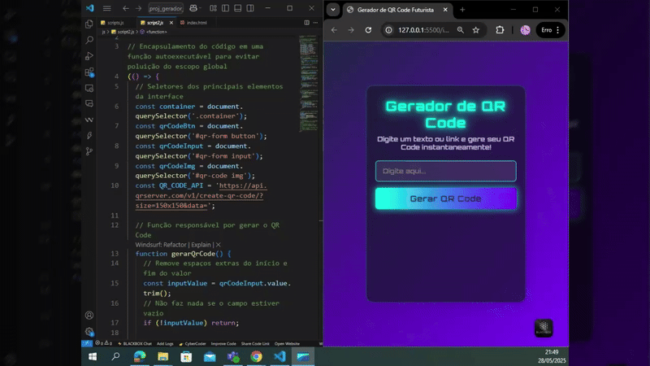

# 🚀 Gerador de QR Code Futurista

## ✨ Sobre o Projeto

Um gerador de QR Code com visual moderno, feito em HTML, CSS e JavaScript puro!  
Digite qualquer texto ou link e gere um QR Code instantaneamente, pronto para compartilhar ou baixar.

---

## 📺 Preview



*A animação acima foi gerada a partir do vídeo de demonstração do projeto.*

---

## 📂 Estrutura de Pastas

├── css/
│ └── styles.css
├── img/
│ ├── qrcode.png
│ └── preview.gif
├── js/
│ └── scripts.js
└── index.html

---

## 🖥️ Demonstração Online

- [🔗 Acesse o projeto no Vercel](https://geradorqr-sigma.vercel.app/)
- [💻 Veja o código no GitHub](https://github.com/ProfRodolfo/geradorqr)

---

## ⚙️ Como Usar

1. **Clone o repositório**
```
git clone https://github.com/ProfRodolfo/geradorqr.git
```
2. **Abra o arquivo `index.html` no seu navegador**
3. **Digite um texto ou link no campo**
4. **Clique em "Gerar QR Code"**
5. O QR Code será exibido automaticamente!

---

## 🛠️ Tecnologias Utilizadas

- HTML5
- CSS3 (visual neon/glassmorphism)
- JavaScript (puro)
- API [qrserver.com](https://goqr.me/api/) para geração do QR Code

---

## 💡 Funcionalidades

- Geração instantânea de QR Code
- Visual moderno e responsivo
- Feedback visual ao gerar o código
- Suporte a qualquer texto ou link

---

## 🤝 Contribuição

Sinta-se à vontade para abrir issues ou enviar pull requests!  
Sugestões de melhorias são sempre bem-vindas.

---

## 📝 Licença

Este projeto está sob a licença MIT.

---

Feito com 💜 por [Prof. Rodolfo](https://github.com/ProfRodolfo)